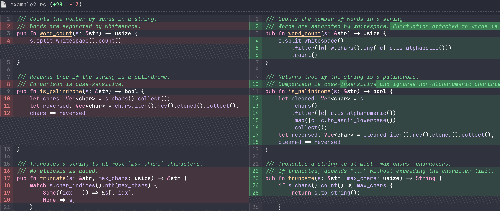
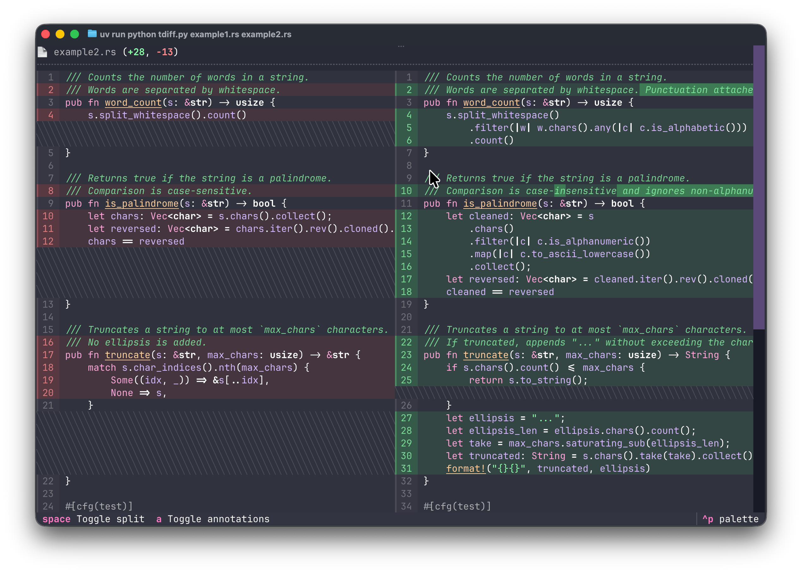
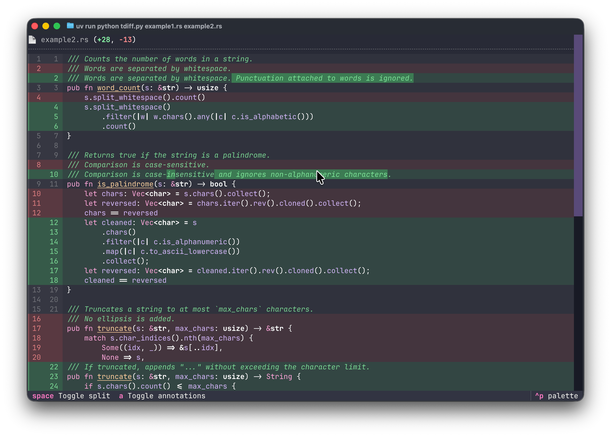
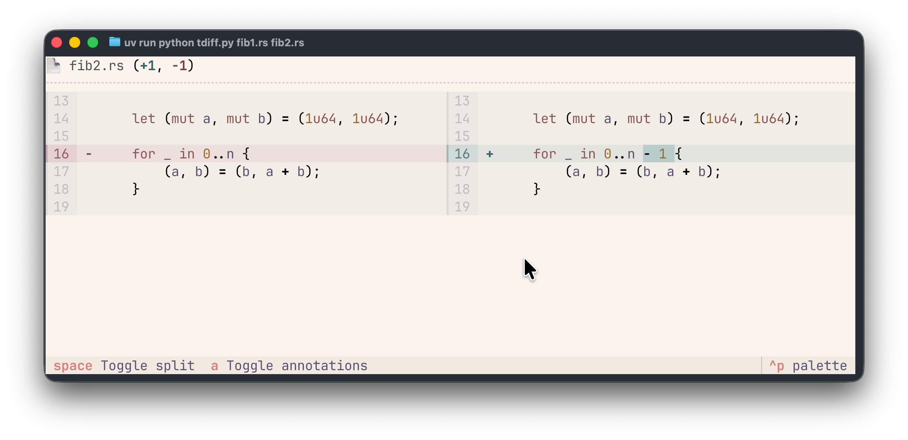
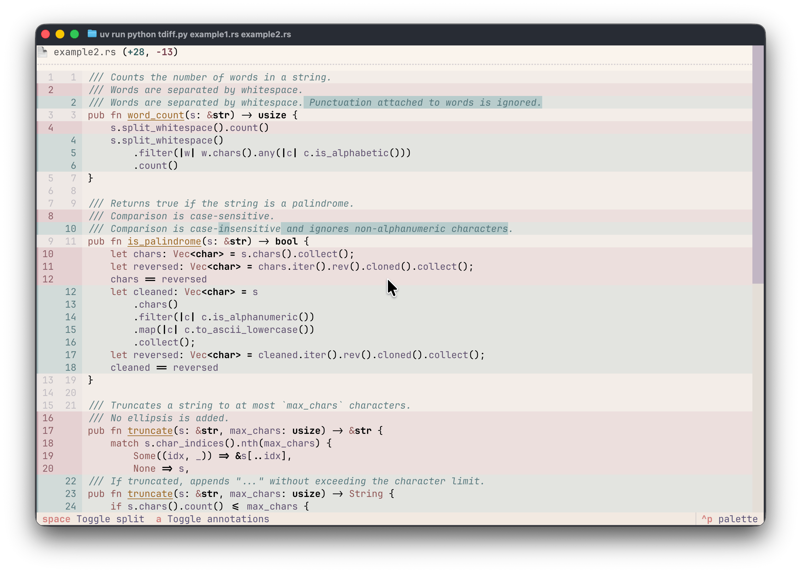
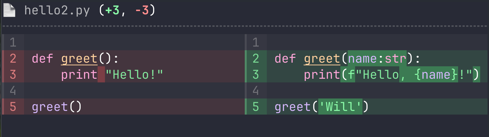

# Textual Diff View

Textual Diff View is a [Textual](https://github.com/textualize/textual) widget to display beautiful diffs in your terminal application.
Originally built for [Toad](https://github.com/batrachianai/toad), this widget may be used standalone.

This is what it can look like...



## Features

The `DiffView` widget displays two versions of a file with syntax and changes clearly highlighted.
Deleted lines / characters are shown with a red highlight.
Added lines / characters are shown with a green highlight.

There are two layout options; a *unified* view which shows the two files top-to-bottom with highlights, and a *split* view which shows the two files next to each other.

`DiffView` can also display annotations ("+" and "-" for added and deleted), to improve readability for color blind users.

Textual's theming system provides a variety of themes for the diff view, both light and dark.

## Example

The following is a simple app to display a diff between two files from the command line.

```python
from textual.app import App, ComposeResult
from textual import containers
from textual.reactive import var
from textual import widgets

from textual_diff_view import DiffView, LoadError


class DiffApp(App):
    """Simple app to display a diff between two files."""

    BINDINGS = [
        ("space", "toggle('split')", "Toggle split"),
        ("a", "toggle('annotations')", "Toggle annotations"),
    ]

    split = var(True)
    annotations = var(True)

    def __init__(self, original: str, modified: str) -> None:
        self.original = original
        self.modified = modified
        super().__init__()

    def compose(self) -> ComposeResult:
        yield containers.VerticalScroll(id="diff-container")
        yield widgets.Footer()

    async def on_mount(self) -> None:
        try:
            diff_view = await DiffView.load(self.original, self.modified)
        except LoadError as error:
            self.notify(str(error), title="Failed to load code", severity="error")
        else:
            diff_view.data_bind(DiffApp.split, DiffApp.annotations)
            await self.query_one("#diff-container").mount(diff_view)


if __name__ == "__main__":
    import sys

    if len(sys.argv) != 3:
        print("Usage python tdiff.py PATH1 PATH2\nTry: python tdiff.py")
    else:
        app = DiffApp(sys.argv[1], sys.argv[2])
        app.run()
```

You can find this file in the `examples/` directory.
Run it with the following:

```
uv run python tdiff.py example1.rs example2.rs
```

Use <kbd>space</kbd> to toggle unified / split, and <kbd>a</kbd> to toggle annotations.


### Screenshots

A few screenshots taken from the example app:

<table>
<tr>  
<td>
  


</td>
<td>
  


</td>
</tr>

<tr>
<td>
  


</td>

<td>
  


</td>

</tr>
</table>

## Installing

Texual Diff View is on PyPI and may be installed with pip, or uv.

Here's how to install with `uv`:

```
uv add textual-diff-view
```

## How to use

Import the widget with the following:

```python
from textual_diff_view import DiffView
```

Then yield an instance of `DiffView` in your [compose](https://textual.textualize.io/api/widget/#textual.widget.Widget.compose) method.

The constructor accepts 4 positional arguments:

| Argument | type | Purpose |
| --- | --- | --- |
| path_original | `str` | A path to the original code |
| path_modified | `str` | A path to the modified code |
| code_original | `str` | The contents of the original code |
| code_modified | `str` | The contents of the modified code |

Additionally, the constructor accepts the standard keyword arguments, `name`, `id`, and `classes`——which have the same meaning as Textual's built in widgets.

Here's a very simple example:

```python
from textual.app import App, ComposeResult
from textual import containers

from textual_diff_view import DiffView

HELLO1 = """
def greet():
    print "Hello!"

greet()
"""

HELLO2 = """
def greet(name:str):
    print(f"Hello, {name}!")

greet('Will')
"""


class Hello(App):
    def compose(self) -> ComposeResult:
        with containers.VerticalScroll():
            yield DiffView("hello1.py", "hello2.py", HELLO1, HELLO2)


Hello().run()

```

Note that we put the `DiffView` within a `VerticalScroll`, so the user may scroll the container if the diff doesn't fit.

The above code will generate the following output:



### Load constructor

DiffView provides an alternative constructor, `DiffView.load`, which also loads the code.
If both your original code and modified code is on disk, this may be simpler than the standard constructor.

`DiffView.load` accepts the following positional arguments:

| Argument | Type | Purpose |
| --- | --- | --- |
| path_original | `str` or `Path` | A path to the original code |
| path_modified | `str` or `Path` | A path to the modified code |

Since `load` is a coroutine, you would typically call it from a message handler in another widget, or `App`, then mount it somewhere in the DOM.

The code would look something like the following:

```python
diff_view = await DiffView.load("original.py", "modified.py")
await self.query_one("VerticalScroll").mount(diff_view)
```

### Reactives

The DiffView supports the following [reactive](https://textual.textualize.io/guide/reactivity/#reactive-attributes) attributes.

| Name | Type | Explanation |
| --- | --- | --- |
| `split` | `bool` | Enables split view when `True`, or unified view when `False` |
| `auto_split` | `bool` | Automatically enable split view if there is enough space to fit the longest lines from both file. |
| `annotations` | `bool` | Enable annotations ("+" or "-" symbols). It is reccomended that apps always offer this for color blind users. |

## Roadmap

There are a few remaining features that I anticipate a need for:

- **Word wrapping** The widget currently supports horizontal scrolling (via mouse-wheel, trackpad, or shift+mouse-wheel).
  This works rather well, but has the downside that it is not especially discoverable.
  An option to enable word wrapping would be useful.
- **ANSI theme** A future version will add support for ANSI themes, which is limited to the user's choice of 16 colors.
  It will never look as good, but some people say they prefer it.

There are also a few more high-effort features that I could be tempted to implement:

- **Swappable diff methods**. There is no perfect diff algorithm. They all have their trade-offs.
  The `DiffView` widget uses Python's `difflib` but it could offer an interface to add other diff algorithms.
- **AST level diffs** A diff view that works at the AST level can offer diffs that more closely reflect how a human might edit code.

## License

DiffView is licensed under the terms of the [AGPL](https://www.gnu.org/licenses/agpl-3.0.en.html) license.
A commercial license if available, if you aren't comfortable with the copyleft restruction.
Contact [Will McGugan](https://x.com/willmcgugan) for more information.
